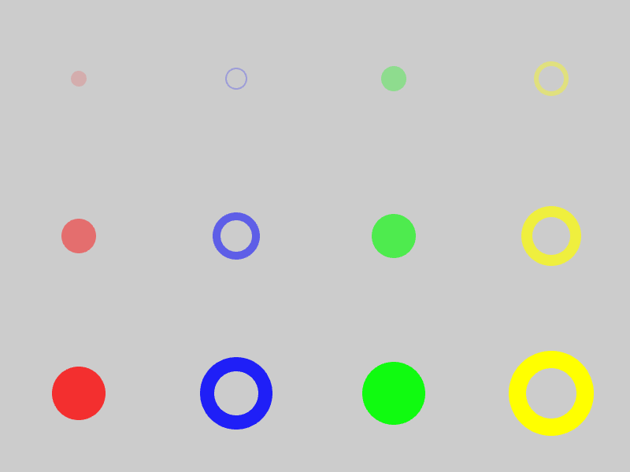

Primitives
==========

Graphical objects that can be drawn by the :class:`Scene` are called
**primitives**.

Wasabi2d offers many different types of primitives:

* Polygons, both filled and stroked
* Sprites
* Text
* Particle groups

.. _colors:

Specifying colors
-----------------

Colors can be specified to any object using the attribute ``color``. There are
many ways to specify color:

* tuples of 3 or 4 floats between 0 and 1 - RGB or RGBA, respectively. If 3
  numbers are given then the alpha value will be 1 (ie. opaque).
* Color names like ``white``, ``yellow`` etc. See :doc:`colors_ref` for a list
  of the color names.
* Hex RGB or RGBA color codes like ``#eecc66`` or ``#eecc6688``

While color channel values of 0-1 map directly to what a computer display can
represent (sRGB), you can give values greater than this. This is particularly
relevant when using :doc:`effects`.

Common Attributes
-----------------

Most primitives support attributes for transforming the position, rotation,
scale and color of the object.

You can pass these as keyword arguments to the factory function, or you can
set them on the primitive object.

Common attributes:

.. attribute:: pos

    2-tuple of floats - the "center" point of the shape

.. attribute:: scale

    A scale factor for the shape. 1 is original size.

    If :attr:`.scale_x` or :attr:`.scale_y` have been separately set then
    accessing this property returns the geometric mean of those values.

    Assigning to `.scale` overwrites `.scale_x` and `.scale_y`.

.. attribute:: scale_x

    The scale factor of the shape in the x direction.

.. attribute:: scale_y

    The scale factor of the shape in the y direction.

.. attribute:: color

    The color of the shape, as :ref:`described above <colors>`.

.. attribute:: angle

    The rotation of the object, as an angle in radians. Because of the
    coordinate system in wasabi2d, increasing angle gives a clockwise
    rotation.

Common methods:

.. method:: .delete()

    Delete the primitive, removing it from the scene.

Creating a sprite
-----------------

`scene.layers` is an automatically initialised sequence of layers. These are
drawn from lowest to highest.

To create a sprite in a layer just call `.add_sprite()`::

    ship = scene.layers[0].add_sprite(
        'ship',
        pos=(scene.width / 2, scene.height / 2)
    )

Sprites must be in a directory named ``images/`` and must be named in lowercase
with underscores. This restriction ensures that games written with wasabi2d
will work on with case sensitive and insensitive filenames.

.. method:: Layer.add_sprite(image, *, [options]) -> ...

    * ``.image`` - the name of the image for the sprite.

    * ``.pos`` - the position of the sprite

    * ``.angle`` - a rotation in radians

    * ``.color`` - the color to multiply the sprite with, as an RGBA tuple.
      ``(1, 1, 1, 1)`` is opaque white.

    * ``.scale`` - a scale factor for the sprite. 1 is original size.

    * ``anchor_x``, ``anchor_y`` - the position within the sprite image that
      is the "anchor point" around which rotation and scaling occurs. By
      defaualt, this is the center of the sprite.

    All of these attributes can be set on the returned sprite object also.

And these methods:

* ``.delete()`` - delete the sprite.

Circles
-------

.. method:: Layer.add_circle(*, radius, [options]) -> ...

    Create and return a circle object.

    Parameters:

    * `radius` - `float` - the radius of the circle, in pixels.
    * `fill` - `bool` - if `True`, the shape will be drawn filled. Otherwise,
      it will be drawn as an outline. This cannot currently be changed after
      creation.
    * `stroke_width` - `int` if `fill` is `False`, this is the width of the
      line that will be drawn.

    Circles, drawn filled and unfilled, with different stroke widths, colours,
    and opacities.

Stars
-----

.. method:: Layer.add_star(*, points, [options]) -> ...

    Create and return a star object.

    Parameters:

    * `points` - `int` - the number of points for the star.
    * `outer_radius` - `float` - the radius of the tips of the points
    * `inner_radius` - `float` - the radius of the inner corners of the star
    * `fill` - `bool` - if `True`, the shape will be drawn filled. Otherwise, it
       will be drawn as an outline. This cannot currently be changed after
       creation.
    * `stroke_width` - `int` if `fill` is `False`, this is the width of the line
      that will be drawn.

Rectangles
----------

.. method:: Layer.add_rect(width, height, *, [options]) -> ...

    Create and return a rectangle primitive.

    Rectangles are initially axis-aligned and positioned at the origin,
    so ``add_rect(10, 20)`` will create a rectangle with top left ``(-5, -10)``
    and bottom right ``(5, 10)``.

    Parameters:

    * `width` - `float` - the width of the rectangle before rotation/scaling
    * `height` - `float` - the height of the rectangle before rotation/scaling
    * `fill` - `bool` - if `True`, the shape will be drawn filled. Otherwise,
      it will be drawn as an outline. This cannot currently be changed after
      creation.
    * `stroke_width` - `int` if `fill` is `False`, this is the width of the
      line that will be drawn.

Polygons
--------

.. method:: Layer.add_polygon(vertices, *, [options]) -> ...

    Create and return a closed polygon.

    * `vertices` - sequence of `(float, float)` tuples. The vertices cannot
      currently be updated after creation.
    * `fill` - `bool` - if `True`, the shape will be drawn filled. Otherwise,
      it will be drawn as an outline. This cannot currently be changed after
      creation.
    * `stroke_width` - `int` if `fill` is `False`, this is the width of the
      line that will be drawn.

Lines
-----

.. method:: Layer.add_line(vertices, *, [options]) -> ...

    A line connecting 2 or more points. Lines cannot be filled. A line object
    consisting of 3 points will be drawn as line segments from point 0 to 1, 1
    to 2, and so on. Corners are bevelled.

    * `vertices` - sequence of `(float, float)` tuples. The vertices cannot
      currently be updated after creation.
    * `stroke_width` - `int` if `fill` is `False`, this is the width of the
      line that will be drawn.

Text
----

wasabi2d supports text labels. The fonts for the labels must be in the `fonts/`
directory in TTF format, and have names that are `lowercase_with_underscores`.

.. method:: Layer.add_label(...) -> ...

    Create an return a text label.

    * `text` - `str` - the text of the label
    * `font` - `str` - the name of the font to load
    * `fontsize` - `float` - the size of the font, in pixels. The actual height
      of the characters may differ due to the metrics of the font.
    * `align` - `str` - one of `'left'`, `'center'`, or `'right'`. This
      controls how the text aligns relative to `pos`.

