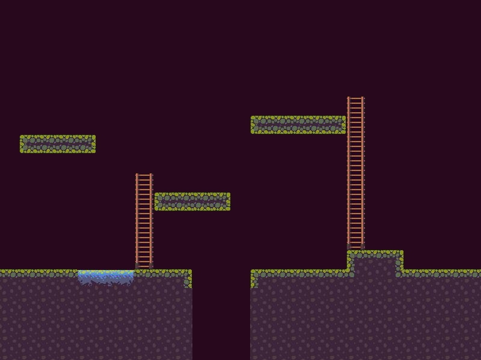
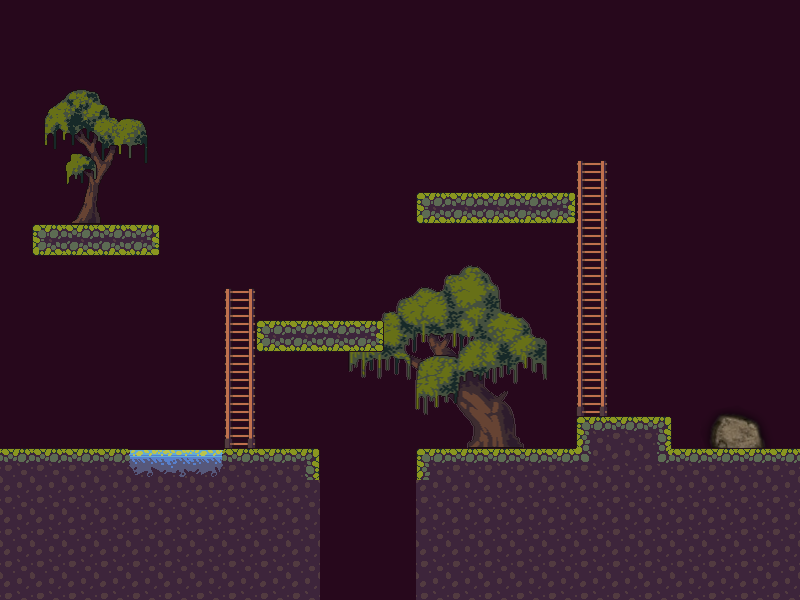

Tile Maps
=========

Many games use a rectangular grid of tile images to represent static parts of a
level, such as floors, platforms, obstacles, background scenery, traps and
more:

    A platform game level made in Wasabi2D with a
    `tile pack from Craftpix <https://craftpix.net/freebies/free-swamp-game-tileset-pixel-art/>`_.

You could use sprite primitives to do this, but because large, scrolling levels
can consist of tens of thousands of tiles, this is relatively expensive
both in terms of memory usage and rendering. Instead Wasabi2D provides a GPU
accelerated tile map that is fast to render even over vast tile maps.

Some of the properties of this tile map:

* You do not need to declare the bounds of the map. Maps do not have to
  have rectangular bounds or be contiguous.
* You can update tiles at any coordinate at any time.
* However the map can use at most 255 tile images. (To use more tiles, consider
  using multiple maps.)

Quickstart
----------

Create a tile map in a layer by calling ``add_tile_map()``. The easiest form of
this requires no arguments. Setting tiles into the map is done by assigning the
name of an image (from the ``images/`` directory) to a coordinate pair:

.. code-block:: python

    tiles = scene.layers[3].add_tile_map()
    tiles[3, 5] = 'tile_sand'

.. method:: Layer.add_tile_map(*, tile_size: Tuple[int, int] = None, any_size_tile: bool = False) -> TileMap

    Create a tile map, initially blank.

    :param tile_size: The dimensions of each tile. If omitted this will be
                      inferred from the first tile you insert into the map.
    :param any_size_tile: If True, allow setting images of any size into the
                          map and resize them; otherwise, all tiles must
                          match `tile_size`.
                          If this is given then `tile_size` is a required
                          parameter.

As well as setting tiles, there are a range of operations to treat the map as a
mapping of coordinate to image name. For example, you can retrieve the tile
values you have already set:

.. code-block:: python

    print(tiles[3, 5])  # prints tile_sand

There are also a number of :ref:`tile-drawing` operations to update the map
in bulk.

Tile Get/Set Operations
-----------------------

.. currentmodule:: wasabi2d.primitives.tile_map

.. automethod:: TileMap.__setitem__

.. automethod:: TileMap.__getitem__

.. automethod:: TileMap.get

.. automethod:: TileMap.setdefault

.. automethod:: TileMap.__delitem__

.. automethod:: TileMap.clear

.. _tile-drawing:

Tile Drawing Operations
-----------------------

All these methods accept a tile parameter given as a string to set in the tile map.

They also accept a list of tile image names. In this case each tile that is
drawn randomly picks from the list::

    tiles = scene.layers[0].add_tile_map()
    tiles.line(
        ['fence1', 'fence2'],  # randomly pick fence tile images
        start=(0, 0),
        end=(20, 0),
    )

You can also pass ``value=None`` in order to clear affected tiles.

.. automethod:: wasabi2d.primitives.tile_map.TileMap.fill_rect

.. automethod:: wasabi2d.primitives.tile_map.TileMap.line

.. automethod:: wasabi2d.primitives.tile_map.TileMap.flood_fill

.. _tiled-tip:

Tips: TilEd
-----------

To design large tile maps it is useful to have an editor. TilEd_ is a great
cross-platform editor that allows you to create tile maps with powerful editing
tools. It also allows you to annotate your tile map with any other data your
game might need, such as the positions of decorations and interactions, and
custom field for each tile.

As Wasabi2D focuses purely on the rendering of tile maps, consider using one
of these libraries to load the data you want from TMX files:

* `tmx <https://pypi.org/project/tmx/>`_
* `PyTMX <https://pypi.org/project/PyTMX/>`_

.. _TilEd: https://www.mapeditor.org/

Tips: Decorations
-----------------

Tile maps can be repetitive. Consider adding additional decorative objects both
behind and in front of your tile map to make areas of a level seem more
individual:

Tips: Shortcut functions
------------------------

The :class:`TileMap` doesn't have built-in features to understand the tile
images you have; it doesn't know which images are edge tiles or connectors.

If you use :ref:`TilEd <tiled-tip>`, it can manage this for you.

If you are building tile maps procedurally it is useful to build abstractions
to help you generate the tile map. For example, here are some functions I wrote
to build platforms or ladders in a game:

.. code-block:: python

    tm = scene.layers[0].add_tile_map()

    def platform(xs, y):
        """Insert a platform into the tile map."""
        x1, x2 = sorted(xs)
        tm[x1, y] = 'platform_left'
        for x in range(x1 + 1, x2):
            tm[x, y] = 'platform_mid'
        tm[x2, y] = 'platform_right'

    def ladder(x, ys):
        """Insert a ladder into the tile map."""
        y1, y2 = sorted(ys)
        tm[x, y1] = 'ladder_top'
        for y in range(y1 + 1, y2):
            tm[x, y] = 'ladder_mid'
        tm[x, y2] = 'ladder_btm'

    platform((1, 4), 7)
    platform((8, 11), 10)
    platform((13, 17), 6)
    ladder(7, (9, 13))
    ladder(18, (5, 12))
